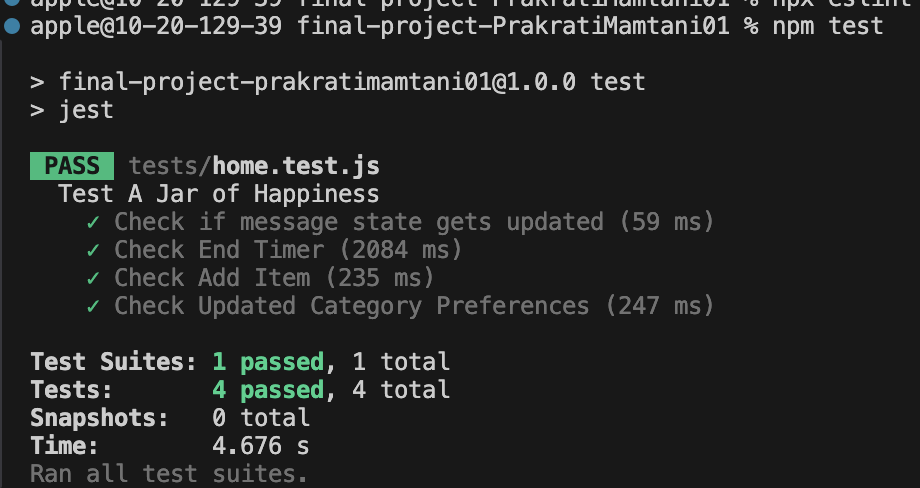

Milestone 04 - Final Project Documentation
===

NetID
---
pm3484

Name
---
Prakrati Mamtani

Repository Link
---
https://github.com/nyu-csci-ua-0467-001-002-fall-2024/final-project-PrakratiMamtani01

URL for deployed site 
---
(TODO: add url for your dpeloyed site; should be in this format http://linserv1.cims.nyu.edu:YOUR_PORT_NUMBER)

URL for form 1 (from previous milestone) 
---
Make sure that the username and password has a length of more than 8 characters.

Special Instructions for Form 1
---
http://linserv1.cims.nyu.edu:34163/register

URL for form 2 (for current milestone)
---
http://linserv1.cims.nyu.edu:34163/home

Special Instructions for Form 2
---
Once you login or register using a valid username you will be redirected to a home page. There you will see a form about how are you feeling today once you select your mood and click open, it will suggest you a song to listen to according to that mood. This has been done by first populating database using spotify API and then reading database to generate appropriate song. This form will generate a modal element and once you close the form the timer will begin and will not be able to submit form again from same user as this project requires that you can only open form once every 24hrs.

URL for form 3 (from previous milestone) 
---
http://linserv1.cims.nyu.edu:34163/home/add

Special Instructions for Form 3
---
Add an item to your personalised jar. If you add an item of category that you iniitally did not select then that category will be added to your preferences. However, the initialisation items from spotify or quotes will not be loaded in your jar.

First link to github line number(s) for constructor, HOF, etc.
---
https://github.com/nyu-csci-ua-0467-001-002-fall-2024/final-project-PrakratiMamtani01/blob/master/app.mjs#L108

Second link to github line number(s) for constructor, HOF, etc.
---
https://github.com/nyu-csci-ua-0467-001-002-fall-2024/final-project-PrakratiMamtani01/blob/master/quotes.mjs#L9

Short description for links above
---
/home is a post route that checks what mood user selected and according to that creates mood array which conincides with the mood for each item in jar. It then finds item in jar that are under the current user, their mood, and their category preferences. It then filters all the item that have not been chosen yet (if all items are chose it is reset). After that it randomly selects one item from all possible valid options and displays that.

populate() function reads through a Json file, maps each item into item schema and then insert that in database.

Link to github line number(s) for schemas (db.js or models folder)
---
https://github.com/nyu-csci-ua-0467-001-002-fall-2024/final-project-PrakratiMamtani01/blob/master/db.mjs

Description of research topics above with points
---
* (5 points) Used Puppeteer library for Headless Chrome testing for few of the concepts that were difficult to test manually. The four tests includes that if a message has been selected then it's status is updated. Now we can perform this manually by selecting item and then checking our database but to simplify this process, the test was written. Second test checks if the timer has started and exists there until the timer is over. To test this manually usually we will have to wait till the timer is there and check at different times that if the timer still exists but this test simplifies that process. Third test is just to check if the add item form adds the item to a user's personalised jar items and fourth test checks that if an item with different category preferences is added then those preferences are updated. Again these can be tested manually by checking database but to simplify these tests were written.
* (5 points) Used Spotify API as backend request to first query the mood in spotify API then select the first playlist from it and then select the first 5 songs for each mood (this can be altered according to your preference and ensures scalability of this idea). These songs are then used to populate database.
* (1 point) Used middleware to ensure that until and unless a user is authenticated they cannot access home or home/add route of the app.
* (1 point) Eslint 
* (1 point) Using Babel with Headless Chrome

Links to github line number(s) for research topics described above (one link per line)
---
* https://github.com/nyu-csci-ua-0467-001-002-fall-2024/final-project-PrakratiMamtani01/blob/master/tests/home.test.js
* https://github.com/nyu-csci-ua-0467-001-002-fall-2024/final-project-PrakratiMamtani01/blob/master/spotify.mjs
* https://github.com/nyu-csci-ua-0467-001-002-fall-2024/final-project-PrakratiMamtani01/blob/master/app.mjs#L39
* https://github.com/nyu-csci-ua-0467-001-002-fall-2024/final-project-PrakratiMamtani01/blob/master/eslint.config.mjs
* https://github.com/nyu-csci-ua-0467-001-002-fall-2024/final-project-PrakratiMamtani01/blob/master/babel.config.json

Optional project notes 
--- 
For unit testing, certain changes were made into the app.mjs. For instance, when you are trying to run home.test.mjs then make sure that on a different terminal the app is running, then change the timer from 24 hours to a small time for instance 2 secs that ensures that makes sure the timer test does not take too long and times out. Here's the screenshot of all the tests passing.

Attributions
---
spotify.mjs - Spotify API setup, get token client ID, and client secret code based off of https://developer.spotify.com/documentation/web-api/howtos/web-app-profile

spotify.mjs/getMoodPlaylist and spotify.mjs/getPlaylistTracks - Spotify mood playlists based off of https://developer.spotify.com/documentation/web-api/reference/get-playlist and https://developer.spotify.com/documentation/web-api/reference/search

spotify.mjs/getMoodPlaylist and spotify.mjs/getPlaylistTracks - Spotify mood playlists based off of https://developer.spotify.com/documentation/web-api/reference/get-playlist and https://developer.spotify.com/documentation/web-api/reference/search

spotify.mjs category names based off of https://github.com/jwilsson/spotify-web-api-php/blob/main/tests/fixtures/category-playlists.json

test/home.test.js - puppeteer usage based of https://github.com/puppeteer/puppeteer/blob/main/docs/guides/page-interactions.md
