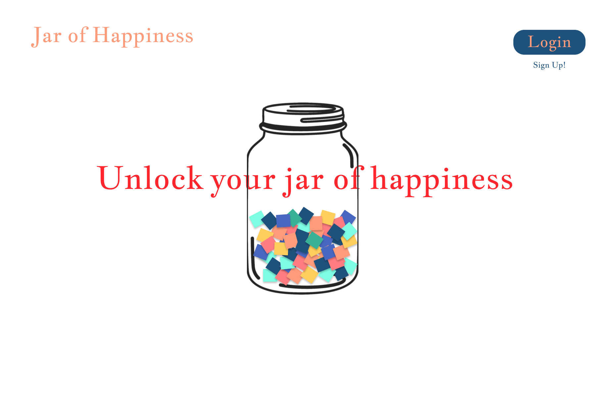
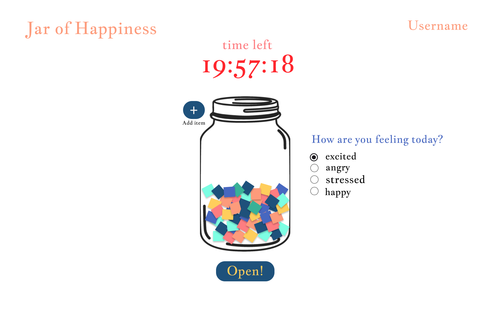
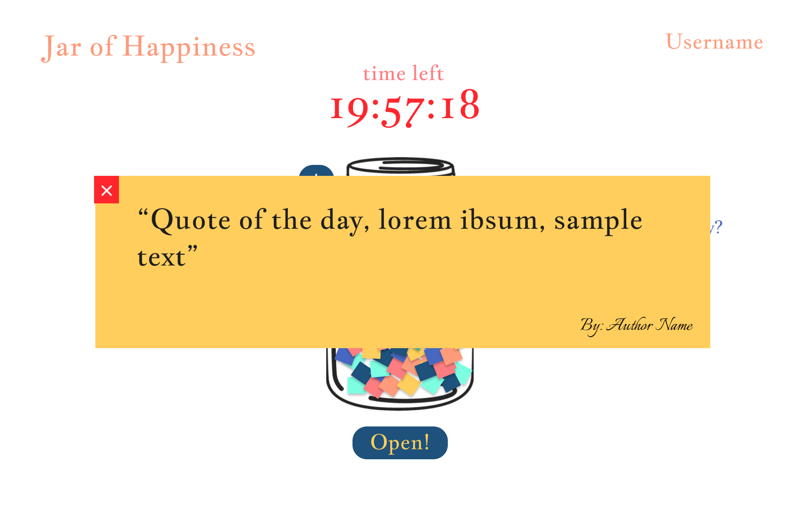
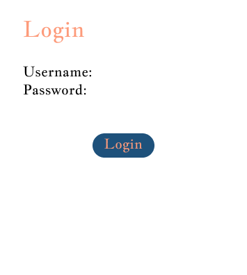
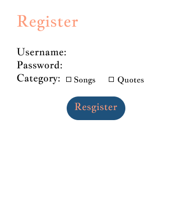
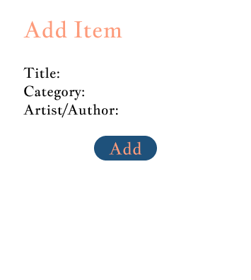
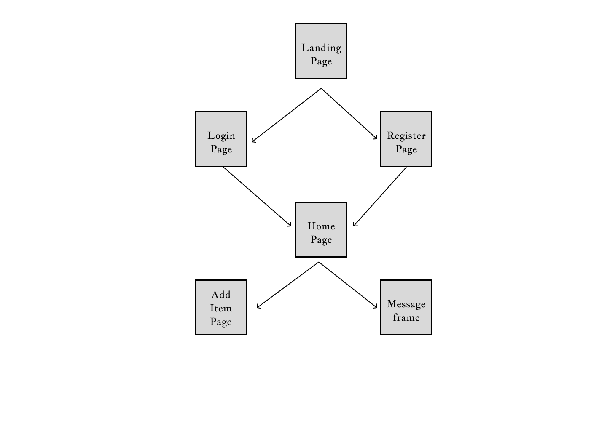

# Jar of Happiness

## Overview

Virtual Jar of Happiness is a web application designed to uplift users by offering daily doses of inspiration in the form of quotes or songs. Users can create their virtual jars by simply registering onto the website; while registration their preferences regarding songs, quotes, or both will be stored. Once the user is logged in they can select their mood of the day and interact with the jar to get their personalized and randomized quote/ song of the day. The user will only be allowed to open the jar once in 24 hours. The users can also add their own latest song, quote to see one day.


## Data Model

The application will store Users, Items

An Example User:

```javascript
{
  username: "shannonshopper",
  hash: // a password hash,
  lastOpened: // timestamp of the last time the user opened the jar,
  Category: [ // an array of category preferences
    "quotes",
    "song",
  ],
  jarItems: { // map of items that contains their status regarding whether they have been previously chosen or not
      'itemId1': false,
      'itemid2': true
  }
}
```

An Example Item:

```javascript
{
  itemID: 123,
  mood: "happy", // mood category (e.g., happy, sad)
  category: "quote", // type of item (e.g., quote, song)
  content: "The only way to do great work is to love what you do." // the actual quote or song name
  author: "Benjamin Franklin" // author of the content
  owner: 'username' // specifies if this item is specific to a user or available for everyone
}
```


## [Link to Commented First Draft Schema](db.mjs) 

## Wireframes

/ - main page for when the user has not logged into account



/home - home page that shows jar after the user is logged in



/home/slug - for when the content/message is displayed



/login - login page



/registration - registration page



/home/add - add item to the jar




## Site map



## User Stories or Use Cases

1. As a non-registered user, I can register a new account with the site by providing my email and password.
2. As a user, I can log in to the site with my registered email and password.
3. As a user, I can select my preference (quotes or songs) for what type of content I want from the jar.
4. As a user, I can select my mood and click on the virtual jar to receive a randomly selected item of that chosen mood.
5. As a user, I cannot open the jar more than once per day.
6. As a user, I can view how much time remains before I can access another item from the jar.
7. As a user, I can add content of any category (quotes or songs) for future jar interactions.
8. As a user, I cannot access the jar or my preferences without logging in, ensuring security and privacy of my content.

## Research Topics

* (1 point) Integrate ESLint into your workflow
    * to make sure it follows coding conventions
* (5 points) Use Puppeteer library for Headless Chrome testing
    * Certain functions need to be tested to make sure the code is working perfectly instead of manually running and checking for each function. Hence, for important functions I have used this form of testing to see if my app works correctly.
* (5 points) Use spotify API to populate the database with song items
    * used Spotify API as backend request to populate data; The usage of API and extracting information is a bit complicated so i have assigned 5 points to it.
* (1 point) Use middleware to ensure that until and unless a user is authenticated they cannot certain pages of app for improved security.
* (1 point) Use Babel with Headless Chrome

12 points total out of 10 research/additional points


## [Link to Initial Main Project File](app.mjs) 

## Annotations / References Used
https://developer.spotify.com/documentation/web-api/howtos/web-app-profile
https://developer.spotify.com/documentation/web-api/reference/get-a-categories-playlists
https://github.com/jwilsson/spotify-web-api-php/blob/main/tests/fixtures/category-playlists.json
https://github.com/puppeteer/puppeteer/blob/main/docs/api/puppeteer.httprequest.md

